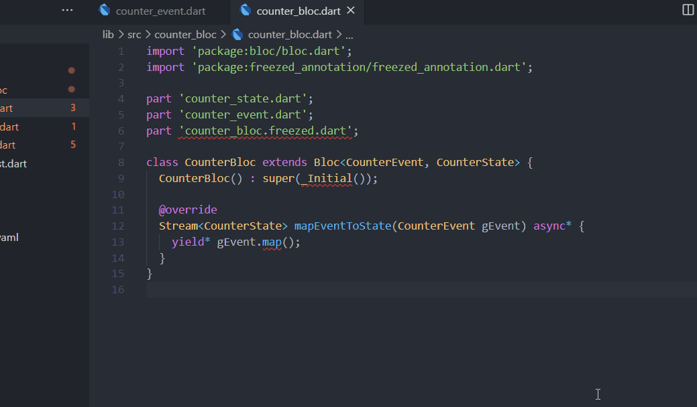
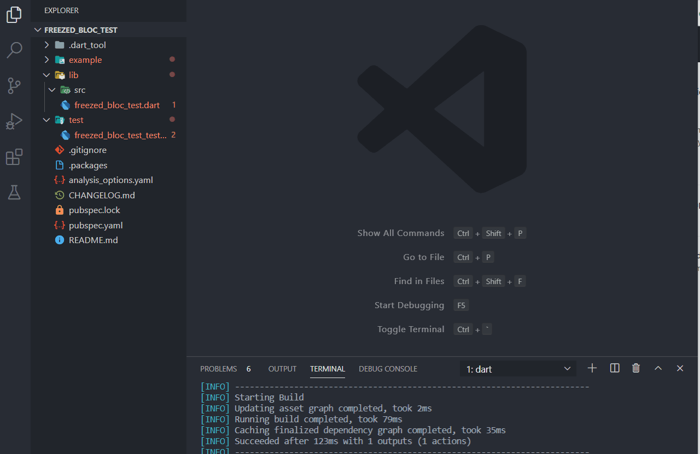

# ## The create template functionality is avaiable at [bloc extension](https://marketplace.visualstudio.com/items?itemName=FelixAngelov.bloc)

## Exmaple usage

create new event

create new freezed bloc

## Features

1. create bloc folder with freezed state and event class.
2. create a new event with ease.

## Known Issues

1. unable to create bloc folder using the command palette
