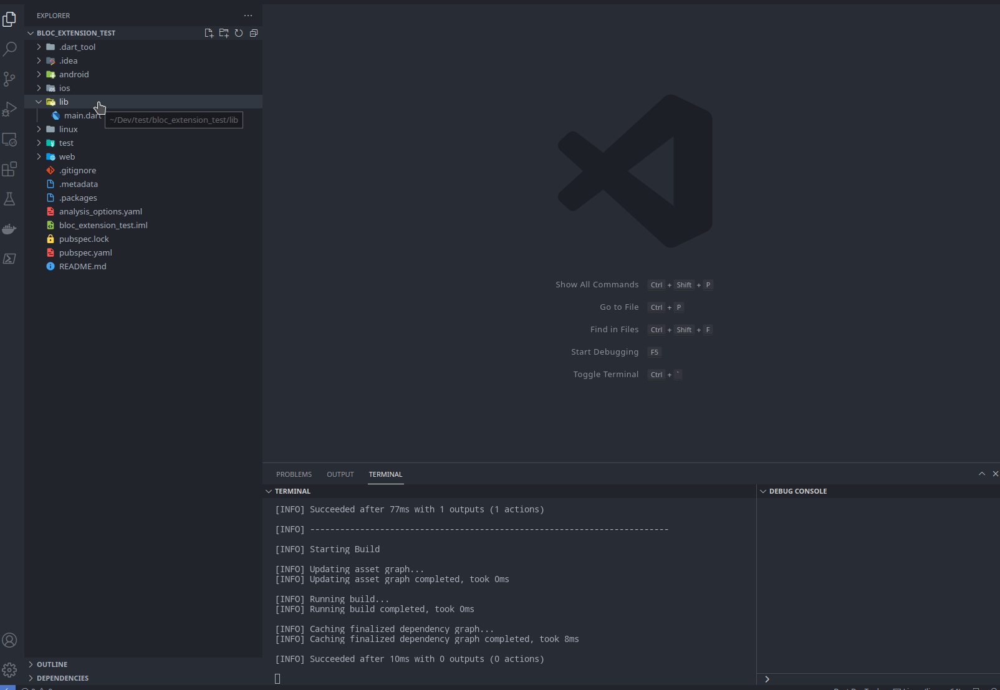
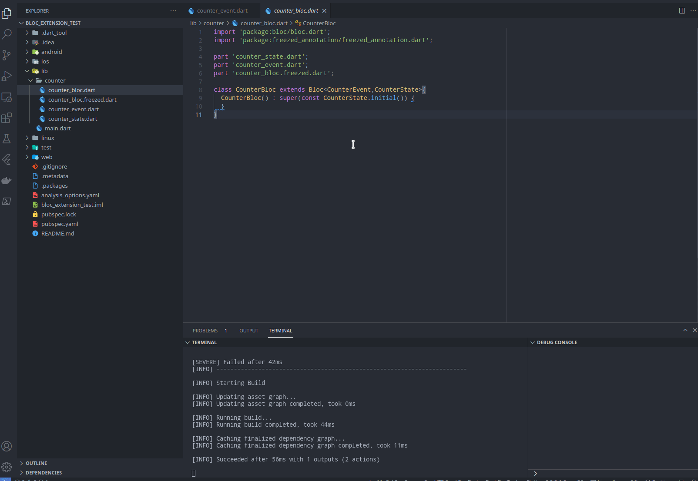

## Exmaple usage

create new new bloc

create new new event

## Features

1. create bloc folder with freezed state and event class.
2. create a new event with ease.
3. snippets

## Known Issues

1. unable to create bloc folder using the command palette
