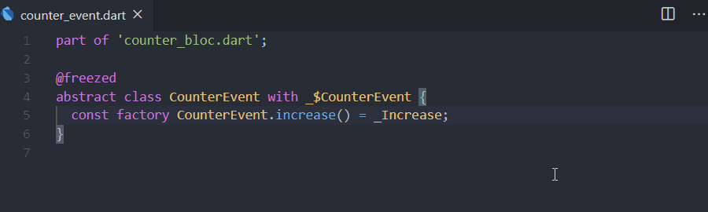
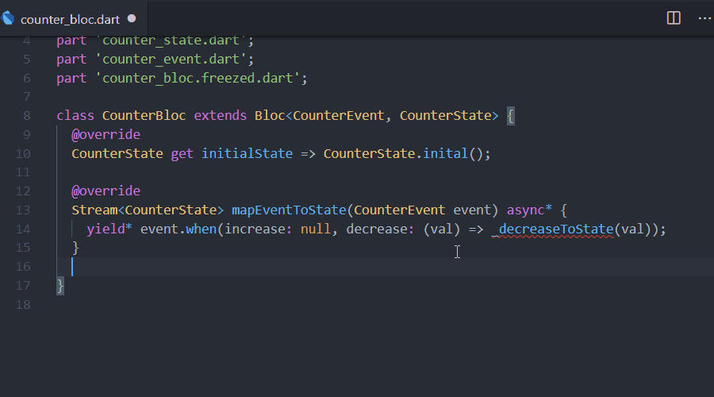

## Exmaple usage

create new freezed bloc

use `feven`/`fstate` snippet

use `fmap` snippet

## Features

1. create bloc folder with freezed state and event class.
2. snippets for create freezed state, event and map event to state function.

| prefix |                       output                        |
| :----- | :-------------------------------------------------: |
| fstate | const factory StateClass.stateName() = \_stateName; |
| fevent | const factory EventClass.eventName() = \_eventName; |
| fmap   |  Stream\<StateClass\> \_eventToState() async\* {}   |

## Requirements

- [freezed package](https://pub.dev/packages/freezed)
- [bloc package](https://pub.dev/packages/bloc)

## Known Issues

1. unable to create bloc folder using the command palette
